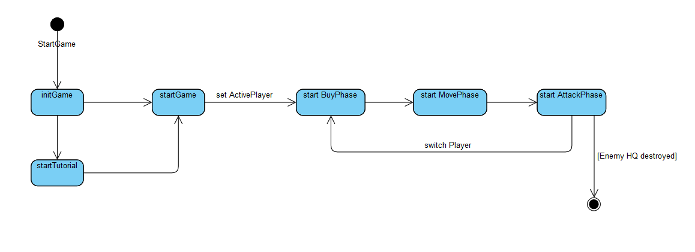
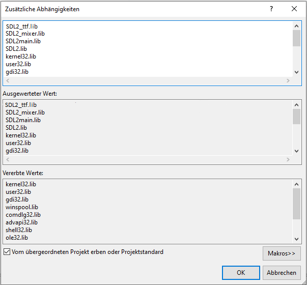

# Trench Tactics

### Inhaltsverzeichnis

- [Inhaltsverzeichnis](#inhaltsverzeichnis)
- [Spielidee/Motivation und Ziele](#spielidee-und-ziele)
- [Vorbedingungen](#vorbedingungen)
- [Komponentenuebersicht](#komponentenuebersicht)
  - [Framework](#framework)
  - [Timer](#timer)
  - [EventManagement](#eventmanagement)
  - [Rendering](#rendering)
  - [Config Reader](#config)
  - [Logger](#logger)
  - [Gamefield](#gamefield)
    - [Tiles](#tiles)
- [Gamelogic](#gamelogic)
  - [GameClass](#gameclass)
  - [Player](#player)
  - [EventGateway](#eventgateway)
- [Architektur](#architektur)
- [Pattern](#pattern)
- [Tests](#tests)


<a name="spielidee-und-ziele"></a>
## Spielidee und Ziele
In der Gamingindustrie geht der Trend hinzu Reboots/Remakes alter und vor allem erfolgreicher Spiele. Fast alle großen Publisher sind auf diesen Zug aufgesprungen. Kürzlich wurde Warcraft 3 Reforged veroeffentlicht, ein Reboot des von Blizzard gepublishtem RTS im Warcraft Universum.
Im Zuge der Suche nach einem geeigneten Thema für ein Programmierprojekt hat sich unsere Gruppe dazu entschieden in eine ähnliche Richtung aufzubrechen. Als Basis wurde Advance Wars ausgewaehlt, ein Nintendo GameBoy Advance Spiel. Advance Wars ist ein rundenbasiertes Strategiespiel, in dem der Spieler verschiedene Militärische Einheiten kontrollieren und diese taktisch klug bewegen, um den Gegner zu besiegen.
Dieses Konzept wird als Basis fuer TrenchTactics uebernommen. Zwei Spieler, die auf einer Karte agieren und Einheiten kaufen, bewegen und mit ihnen kämpfen koennen. Ziel des Spiels ist das gegnerische Hauptgebäude zu zerstoeren. In unserer Version wird das Spiel als Hot-Seat Spiel entwickelt, dies bedeutet das die beiden Spieler abwechselnd an einem Client spielen und ihre Aktionen durchfuehren.
Diese Basis wird dann in Gewissen Aspekten weiterentwickelt. Moderne Element sollen in das "alte" Spielkonzept mit einfließen. Das "AutoBattler" Genre ist genauso ein modernes Spielkonzept, das erst in den letzten Jahren groß geworden ist, aus eben diesem Genre werden zwei wichtige Konzepte mit in TrenchTactics einfließen. 
Das erste Konzept ist die Mechanik das Einheiten, die dem Spieler zum Kaufen zur Verfügung gestellt werden, per Zufall ausgewaehlt werden. Diese Zufallsauswahl kann dann von dem Spieler erneut ausgeführt werden, um eine neue Auswahl an Einheiten zu bekommen.
Hierfür wird eine Währung benötigt, um einen solchen "ReRoll" zu bezahlen. Deswegen wird hier, wieder aus dem AutoBattler Genre, die naechste Erweiterung gestohlen und ein Wirtschaftssystem implementiert. Verschiedene Faktoren haben hier Auswirkung auf das Einkommen das Runde fuer Runde an die Spieler ausbezahlt wird.


#### Ablauf des Spiels:

Ziel des Spiels ist es das gegnerische Hauptgebäude zu zerstoeren.
Als zusaetzliche namensgebende Mechanik wurden noch Schützengräben eingefuegt.
Diese geben Einheiten einen defensiven Bonus und dem Spieler eine höhere Einkommensrate.



Nachdem man das Tutorial durchlaufen hat, oder direkt ein Match startet, werden die drei grundlegenden Phasen, Buy, Move und Attack, durchlaufen.

- Buy Phase: Kaufen neuer Einheiten oder einen "ReRoll" durchführen
- Move Phase: Bewegen der Einheiten und Schützengräben ausheben
- Attack Phase: gegnerische Einheiten bzw. Hauptgebäude angreifen und weitere Schützengräben ausheben

<a name="vorbedingungen"></a>
## Vorbedingungen
Bisher wurde TrenchTactics nur fuer Windows compiled - den Versuch andere Betriebssysteme zu nutzen bitte nur auf eigene Gefahr!
Um das Projekt zum jetzigen Zeitpunkt benutzen zu koennen und zu debuggen werden folgende Frameworks und Software benoetigt:
- Visual Studio 2019
- SDL2.dll
- SDL2_tff.dll
- SDL2_mixer.dll
- zlib1.dll
- libfreetype-6.dll

Alle .dlls sind jedoch mit im Repository hinterlegt und muessen somit nicht manuell mit eingebunden werden, wenn die precompiled Version genutzt wird.

Derzeit wird TrenchTactics als Windows Application compiled, um eine Application mit Console zum Zwecke des Debuggings zu compilen muss eine kleine Codeveraenderung vorgenommen werden. 
Die rot unterstrichene Zeile muss hinzugefügt werden:


#### Folgende Einstellungen unter Project Properties muessen getroffen werden um TrenchTactics mit VisualStudio 2019 kompilieren zu koennen:

###### General Settings

###### Include Directories

###### Library Directories

###### Linker Input Settings



<a name="komponentenuebersicht"></a>
## Komponentenuebersicht
Im Folgenden werden die einzelnen Komponenten beschrieben, die zusammen eine Basis schaffen, um die logische Funktionalitaet von TrenchTactics zu bewerkstelligen.
Alle Komponenten sind auch noch mit Code Kommentaren in Doxygen hinterlegt. 

<a name="framework"></a>
### Framework
Das Framework das im Projekt TrenchTactics ist [SDL2](https://www.libsdl.org/).
 
Link zu komplettem Klassendiagramm: [Klassendiagramm](Doku/ClassDiagram.jpg)

SDL2 stellt hauptsaechlich Grundfunktionalitaeten zur Verfuegung, in unserem Projekt speziell:
- Laden der einzelnen Sprites die im Spiel verwendet werden
- Darstellen der Sprites
- Animation der Sprites
- Annahme des User Input per Maus (bisher ist kein Keyboard-Input moeglich)

SDL2 passt fuer unsere Anforderungen am besten, da wirklich nur Basis Funktionen genutzt werden sollen. Andere Optionen, wie z.B. Unity als GameFramework wurden zwar in Betracht gezogen aber nicht ausgewaehlt. Solche Frameworks bieten sehr viel Basisfunktionalitaet, jedoch ist unsere persoenliche Preferenz fuer dieses Projekt so wenig Code von Frameworks zu nutzen wie moeglich.

<a name="timer"></a>
### Timer
Link zu DoxygenFile: [TimerClass](Doku/Doxygen/html/class_timer.html)


TrenchTactics ist ein Timer bzw. Tick based Spiel. Dies bedeutet das Aktionen jeweils pro Tick abgearbeitet werden.
Angenommen ein der User betaetigt einen Knopf wird diese Aktion (in diesem Fall von SDl2) gespeichert und nach jedem Tick durch die jeweilig zustaendigen Funktionen verarbeitet. (zu sehen im Kapitel EventManager: processEvents()) 
Dies hat den eindeutigen Vorteil das dadurch kein Gedanke an Threading verschwendet werden muss. Die Nachteile, die sich dadurch ergeben wuerden, wie etwa Latenz, sind jedoch fuer TrenchTactics nicht allzu ausschlaggebend und werden somit gekonnt ignoriert.

In der Timer Klasse wird die letzte Zeit (Tick), bereits vergangene Zeit und jetztige Zeit gespeichert und durch Aufrufen der Funktion Update aktualisiert.
Diese Funktion wird bei jedem update des Spiels aufgerufen. Hier wird dann auch die Zeit ueberprueft und ein entsprechender "sleep" eingebaut der dafuer sorgt das der Ablauf des Spiels nicht zu schnell passiert.
Ebenfalls ist hier zu sehen das die SDL Funktion GetTicks aufgerufen wird,die die Anzahl der bereits vergangenen Ticks zurueckgibt. 


```c++
/**
 * updates timer data to the next tick.
 *
 */
void CTimer::Update()
{
	m_fCurTime = SDL_GetTicks() / 1000.0f;
	m_fElapsed = m_fCurTime - m_fLastTime;
	m_fLastTime = m_fCurTime;
}
```
<a name="eventmanagement"></a>
### EventManagement

Als Grundkonzept fuer das Eventmanagement wurde ein so gennanter EventBus eingefuehrt. Der uber publish/subscribe Methoden Events an Logik Komponenten übergibt. Technisch registriert sich eine Methode aus einer Klasse fuer ein Event und gibt an welche Funktion fuer das entsprechende Event ausgefuehrt werden soll.
```c++
EventBus::instance().subscribe(this, &Game::handleStartGame);
void Game::handleStartGame(StartGameEvent* event);
```
In der ersten Zeile sieht man hier die subscribe Methode, die als Argumente die Instanz der ausführenden Klasse sowie die Methode der Klasse, die sich um das Event kuemmern soll. 
Die zweite Zeile beschreibt dann die Methode, die das Event behandelt. Hier wird als Parameter das spezialisierte Event angegeben. Uber diesen Parameter wird dann im EventBus auch entschieden ob die Funktion aufgerufen wird oder nicht.


In der Ubersicht sieht man alle moeglichen Events, die verwendet werden. Auf das ein oder andere Event wird spaeter noch genauer eingegangen.

Der Publish des Events funktioniert dann aequivalent einfach. Uber eine Instanz des EventBus wird ein Event instance ueber die publish Funktion an alle Abonennten verteilt.
```c++
EventBus::instance().publish(new DeathEvent(this->getptr()));
```
Zusaetzlich zum EventBus gibt is im Event Kontext noch den EventManager an sich:


In dieser Klasse werden User Eingaben behandelt. Dies bedeutet hier werden Events erzeugt und auf den EventBus gelegt und dann entsprechender Stelle behandelt. 
Als Abstraktions Ebene wurde hier ein Interface eingezogen, hinter dem sich dann die SDL2 spezifischen Aktionen verstecken.
Die Implementierung basiert hier auf, wie eben erwaehnt, SDL2 Funktionen. Technisch wird hier dann pro Timer Tick ueber die Funktion 
```c++ 
SDL_PollEvent(&Event)
```
geprueft ob ein Event innerhalb des letzten Ticks vorgefallen ist und dann wie erwaehnt umgewandelt und weitergeleitet.

<a name="rendering"></a>
### Rendering
Link zu DoxygenFile: [RendererImpl](Doku/Doxygen/html/class_renderer_impl.html)


Das Rendern der verschiedenen Sprites nutzt hier, wieder, ein SDL2 interne Funktion.


Wird genau wie der EventManager hinter einem Interface versteckt - dies gewährleistet das, falls nötig, ein Framework Wechsel nicht eine komplette Code Änderung mit sich bringt.

Jede Ressource, die gerendert werden soll, hat eine Referenz zu einer Instanz der Klasse Sprite:
```c++
m_sprite = make_shared<SpriteUnit>(colorRed, unittype);
```
Hier im Beispiel der Unit Klasse die bei der Erstellung anhand des Unittype die entsprechenden Sprites laed. 
Die Sprite Klasse:


Wie man erkennen kann beinhaltet die Klasse alle noetigen technischen Mittel, um die entsprechende Sprite zu laden.
Technisch wird ueber einen Filepath die Sprite geladen. Dann kann entweder die komplette Sprite oder nur einen Ausschnitt an einer bestimmten Position gerendert werden. Dies laeuft dann über die Referenz auf den SDL Renderer der ueber die RendererImpl bereitgestellt wird.
Genauer Ablauf am Beispiel einer Unit als Aktivitaetsdiagramm (dies beschreibt den Ablauf des renderns einer Unit):


Ab dem Punkt an dem die Funktion SDL_RenderCopy aufgerufen wird, kuemmert sich SDL um die Darstellung. Hier zu sehen als Uebergabe Parameter der Renderer, zwei Rectangles, sowie die Sprite. Ein Rect beschreibt den Ort, an dem die Sprite gerendert werden soll, dass andere den Ausschnitt des kompletten Sprites, der gerendert wird. (e.g. erste Phase einer Animationsreihe)

Außerdem gibt es hier die Möglichkeit Animationen zu realisieren. Dies funktioniert ueber die eben erwähnten Ausschnitte:


In diesem Bild sieht man die einzelnen Ausschnitte der Animation, mit Hilfe der verschiedenen Ausschnitte und mit Hilfe des Timers können so Animationen angezeigt werden. Nach jedem Tick wird der nächste Ausschnitt geladen.
Als kleine Side-Note: Hier sieht man die pinke Hintergrundfarbe, diese wird verwendet, um die Sprite vom Hintergrund zu trennen. Bedeutet nur die wirklichen Pixel der Unit werden gerendert und das pink sozusagen ausgeschlossen.

<a name="config"></a>
### Config Reader
Link zu DoxygenFile: [ConfigReaderClass](Doku/Doxygen/html/class_config_reader.html)


Um alle noetigen Einstellungen treffen zu koennen wurde ein entsprechendes Config System implementiert.
Alle wichtigen Informationen wie Balancing, Pfade zu Sprites, sowie alle sonstigen Einstellungen die sonst ausserhalb des Spiels getroffen werden koennten. Hierzu werden verschieden JSON Dokumente verwendet.
Hier als Beispiel ein Ausschnitt aus einer Config einer Einheit.

```json
{
  "ap": 2,
  "apCostAttack": 1,
  "movementRange": 1,
  "apCostTrench": 1,
  "apCostMove": 1,
  "cost": 60,
  "dmg": 40,
  "hp": 80,
  "id": 0,
  "name": "Grenadier",
  "range": 12,
  "spawnProbability": 30,
  "spritesRed": {
    "standingActive": "../Data/Sprites/R_Units/R_GRENADE_STANDING_ACTIVE.bmp",
    "standingNeutral": "../Data/Sprites/R_Units/R_GRENADE_STANDING_NEUTRAL.bmp",
    "standingDark": "../Data/Sprites/R_Units/R_GRENADE_STANDING_DARK.bmp",
    "shooting": "../Data/Sprites/R_Units/R_GRENADE_SHOOTING.bmp",
    "running": "../Data/Sprites/R_Units/R_GRENADE_RUNNING.bmp"
  },
  "spritesBlue": {
    "standingActive": "../Data/Sprites/B_Units/B_GRENADE_STANDING_ACTIVE.bmp",
    "standingNeutral": "../Data/Sprites/B_Units/B_GRENADE_STANDING_NEUTRAL.bmp",
    "standingDark": "../Data/Sprites/B_Units/B_GRENADE_STANDING_DARK.bmp",
    "shooting": "../Data/Sprites/B_Units/B_GRENADE_SHOOTING.bmp",
    "running": "../Data/Sprites/B_Units/B_GRENADE_RUNNING.bmp"
  }
}
```

Zum Start des Spiels werden einmalig alle Konfigurationen geladen. Der komplette Config Reader ist ebenfalls mit dem Singelton Pattern gebaut, heißt die eine Instanz, die zum Start des Spiels erstellt wird und alle Konfigurationen befüllt bleibt die komplette Laufzeit im Speicher und vermeidet hier unnoetigen IO Traffic.
Die erstmalige Instanziierung und Initialisierung passiert in der Game Klasse mit folgendem Code:
```c++
ConfigReader::instance().initConfigurations();
```

Im spaetern Verlauf kann man dann ueber die Instanz auf alle Konfigurationen zugreifen ala:
```c++
 ConfigReader::instance().getMapConf()->getSeed());
```

Folgende Konfigurationsobjekte sind verfuegbar:
- BalanceConf
- ButtonConf
- MapConf
- MenuBarConf
- TechConf
- TileConf
- UnitConf

Teilweise werden Konfigurationen zusammengefasst und in einer gemeinsamen JSON Datei abgelegt und erst dann im Programmcode wieder aufgeteilt.

<a name="logger"></a>
### Logger
Link zu DoxygenFile: [LoggerClass](Doku/Doxygen/html/class_logger.html)


Fuer das ganze Spiel wurde ein Logger implementiert.
Dieser kann verwendet werden ueber:
```c++
Logger::instance().log(LOGLEVEL::INFO, "Initializing Tutorial");
```
In dem Enum LOGLEVEL sind die aus Java bekannten LOGLEVEL hinterlegt. Als zweites Argument wird einfach die Logmessage angegeben.

<a name="gamefield"></a>
### Gamefield
Link zu DoxygenFile: [GamefieldClass](Doku/Doxygen/html/class_gamefield.html)


Als Basis fuer die Erstellung des Gamefields werden so genannte Tiles verwendet. Das sind kleine Ausschnitte des gesamten Spielfelds mit fest gesetzter Pixelgroeße von 64\*64. Aus diesen Tiles wird das komplette Spielfeld erzeugt, jede einzelne Sprite ist auf das 64\*64 Fenster ausgelegt.


Hier als Beispiel eine solche Sprite die zur Erstellung des Spielfeldes genutzt wird. Durch eine festgesetzte Größe, die zu einem spaeteren Zeitpunkt noch variable einstellbar gemacht werden soll, wird das Spielfeld erzeugt. Dieses Spielfeld sind nur zwei ineinander geschachtelte Vektoren die Referenzen zu den einzelnen Tiles halten.

```c++
std::shared_ptr<vector<vector<std::shared_ptr<FieldTile>>>> playingfield;
```

Die Erstellung des Spielfelds erfolgt dann ueber:
```c++
for (vector<vector<std::shared_ptr<FieldTile>>>::iterator xIter = playingfield->begin(); xIter != playingfield->end(); ++xIter) {
  for (vector<std::shared_ptr<FieldTile>>::iterator yIter = xIter->begin(); yIter != xIter->end(); ++yIter) {
    int rnd = rand() % 6;

    if (rnd <= 3) {

      *yIter = createFieldTile((xIter - playingfield->begin()) * 64 + 2 * 64, (yIter - xIter->begin()) * 64, FieldTile::TERRAINTYPE::MUD);;
    }

    if (rnd == 4) {
      *yIter = createFieldTile((xIter - playingfield->begin()) * 64 + 2 * 64, (yIter - xIter->begin()) * 64, FieldTile::TERRAINTYPE::STONE);
    }

    if (rnd == 5) {
      *yIter = createFieldTile((xIter - playingfield->begin()) * 64 + 2 * 64, (yIter - xIter->begin()) * 64, FieldTile::TERRAINTYPE::CLAY);
    }
  }
	}
```
Hier sieht man dann bereits, dass das Spielfeld zufaellig erzeugt wird. Außerdem werden hier die Positionen der Tiles mit dem Faktor 64 in Pixelvalues umgerechnet. Der Offset von 2\*64 ist hier eingefuegt um den Spielerbereich des rechten Spielers zu ueberbruecken.

Zugegebenermassen ist die diese Erstellung an verschiedenen Stellen eher komplex (zumindest aus Codetechnischer Sicht), aber hilft durch die Unterteilung in die einzelnen Tiles enorm (zum Beispiel beim rendern von Units auf entsprechende Tiles).
Die Klasse Gamefield ist deswegen auch mit die komplexeste Klasse des kompletten Projekts.

<a name="tiles"></a>
#### Tiles
Link zu DoxygenFile: [TileClass](Doku/Doxygen/html/class_tile.html)


Die hier eingesetzten Tiles haben nicht nur die Aufgabe der Darstellung der Sprites sondern sind gleichzeitig Datencontainer des Gamefields. In den Tiles werden so zum Beispiel Units abgelegt, die auf ihnen residieren. Aber auch alle Buttons, das Headquarter oder Trenches sind hier abgelegt.
Ueber diese Mapping zwischen Tile und Objekt kann dann sehr einfach zugeordnet werden, wo der User hingeclickt hat, bzw. auf welches Objekt er zugreifen wollte.
Außerdem vereinfacht, dass das Rendering. Wie bereits zuvor erklärt braucht die Sprite immer ein Zielort zum Rendern, durch das Ablegen auf der Tile wird einfach die Position der Tile übernommen. Dadurch wird dann, zum Beispiel, die Unit Sprite einfach ueber das Gamefieldtile drüber gerendert.
Beim Entfernen der Unit wird dann einfach der Hintergrund neu gerendert, um die alte UnitSprite zu überdecken.

<a name="gamelogic"></a>
## Gamelogic
Die logischen Komponenten sind in drei Teile aufgeteilt, bzw. in zwei logische Komponenten und eine Klasse Player die hauptsaechlich als Datencontainerklasse dient und alle Referenzen zu den Spieler spezifischen Daten hält.

<a name="gameclass"></a>
### GameClass
Link zu DoxygenFile: [GameClass](Doku/Doxygen/html/class_games.html)


Die eigentliche GameClass ist die Hauptkomponente zur Kontrolle des Spiels. Hier werden alle nötigen Initialisierung Aufgaben erledigt so wie die Hauptschleife des Spiels gestartet.


Wie im Klassendiagramm zu sehen laufen einige Events in der Gameklasse zusammen die Basiskonzepte eines Spiels behandeln (GameEnd, EndTurn, EndTutorial, StartTutorial,...).
Je nach Event wird das Spiel in den entsprechenden State versetzt, der von Game kontrolliert wird.
Neben den nicht Spielablauf spezifischen States (wie zum Beispiel der Tutorialstate) ist das Spiel in drei Unterphasen pro Spielzug unterteilt.
Die Kaufphase in der ein Spieler Einheiten kaufen kann.
Eine Movephase in der ein Spieler Einheiten bewegen kann.
Und eine Attackphase in der ein Spieler Einheiten kaufen kann.
Waehrend der Move- und Attackphase kann der Spieler außerdem noch Gräben bauen.

Die Gameklasse iteriert ueber die Gamephases die immer nacheinander Abfolgen (ein Zurück gehen in Phasen ist nicht möglich). Wenn alle drei Phasen von einem Spieler durchlaufen worden sind, werden die drei Phasen für den anderen Spieler gestartet.
Einzelne Phasen, und der ganze Zug, koennen per Knopfdruck uebersprungen werden. Um einen kompletten Zug zu ueberspringen wird ein entsprechendes Event ausgeloest und von der Gameklasse verarbeitet. Das Ueberspringen einzelner Phasen wird spaeter noch erklaert.
Wichtig ist ebenfalls das hier in jedem MainLoop der Timer aktualisiert wird und entsprechend die UI in die naechste "Phase" schiebt.
Wie bereits erwaehnt werden ueber den Timer Animation realisiert aber auch das allgemeine Rendering ist über den Timer getriggert.
Die UpdateFunktion:
```c++
void Game::updateGame() {
  updateAllUnits();
  renderer.updateTimer();
  manager.processEvents();
}
```
Dieses Update wird laufend aufgerufen in jeder Phase des Spiels. Die jeweils naechste Phase eines Spiels wird durch gewisse Bedingungen erreicht, die auch in der Game Klasse ueberprueft werden. So wird in der Kaufphase darauf gewartet, dass der Spieler seinen Einheitenkauf bestaetigt. In der Move- und Attackphase wird abgewartet ob der Spieler jede Unit, die er besitzt, auch bewegt bzw. falls moeglich mit ihr angreift. Dies funktioniert ueber das Abarbeiten einer Queue, in der alle Units des Spielers hinterlegt sind. 
```c++
while (!this->activePlayer->getUnitQueue().empty() || this->activePlayer->getBuying()) {
  updateGame();
}
```
Hier ist nun auch erkennbar wie eine einzelne Phase uebersprungen werden kann. Bei Move- und Attackphase wird einfach die Queue geleert. In der Buyphase einfach der entsprechende Status, der geprueft wird, geaendert.

<a name="player"></a>
### Player
Link zu DoxygenFile: [PlayerClass](Doku/Doxygen/html/class_player.html)


In der Klasse Player wird sich hauptsaechlich um Spieler spezifische Dinge gekuemmert. Geld, Einheiten oder "Supply" zum Beispiel. Technisch ist das nicht sonderlich aufregend und sollte zum Großteil selbsterklärend sein und wird deshalb hier eher stiefmütterlich behandelt.

<a name="Event Gateway"></a>
### EventGateway
Link zu DoxygenFile: [EventManager](Doku/Doxygen/html/class_event_gateway.html)


Das EventGateway ist mit die wichtigste Komponente im Spiel. Alle Events die von SDL als Aktion aufgenommen werden und an den EventBus weitergeleitet werden, landen in einem ersten Schritt hier.
Hier wird dann geprueft mit Hilfe der Phase und der Position des MouseClickEvents was der User eigentlich bezwecken wollte, verarbeitet und an entsprechender Stelle ausgefuehrt. Als Basis hierfuer kennt das EventGateway den derzeitig aktiven Spieler sowie die aktuelle Phase des Spiels. Fast alle anderen wichtigen Informationen werden ueber Singeltons abgerufen.
Beispiel Kauf einer Unit im EventGateway:


<a name="architektur"></a>
## Architektur


Im oben zu sehenden Bild gibt es einen kurzen Überblick ueber die grobe Architektur im Projekt, was im folgenden Schritt fuer Schritt erklaert werden soll.
Die einzelnen (wichtigen Komponenten) wurden bereits genau erklaert. In diesem Abschnitt soll es nun nur noch um den Zusammenhang der einzelnen Klassen gehen.

Die Architektur kann grundsaetzlich grob in die fünf deutlich zu sehenden Elemente unterteilt werden. 
Als Basis stehen an vielen Stellen die SDL2 Standardfunktionen, wie zum Beispiel das Abgreifen der User Inputs im letzten Zeitframe. Auch bereits erklaert wurde die Config ueber die ein Großteil der Informationen ins Spiel fließen.

User Input wird durch den EventManager von SDL2 entgegengenommen und auf den entsprechenden Bus gelegt. Dazwischen steht dann das so genannte  "EventGateway". Von hier aus werden dann die Events dann zum Teil ausgeführt oder an eine Ausführende Stelle weitergeleitet.

Die hier entstehenden Aktionen sind dann zum Beispiel die Bewegung von Units, Einkaufen von Units oder ähnliches. Hieraus folgen Änderungen, wie zum Beispiel das Anpassen des Vermögens eines Spielers welches dann zentral verarbeitet werden kann.

Alle visuellen Veraenderungen werden ueber die Sprites gehandelt und dann automatisch mit jeder zeitlichen Iteration gerendert. Das bedeutet das zum Beispiel das Szenario schießen einer Unit so realisiert wird, dass der Status der Einheit geändert wird, hierüber folgt eine Änderung der derzeitig aktuellen Sprite. Sobald dann ein Timer update passiert, wird das aktuelle Sprite gerendert (hier im Spezialfall Schießen wird eine Animation gestartet).

Im gesamten Projekt wurde darauf geachtet die Verbindung zu SDL2 nicht zu starr zu implementieren. Nahezu jede SDL Funktion wurde hinter Interfaces "versteckt". Am besten zu sehen am Beispiel des EventManagers der den User Input behandelt. (genauer zu sehen im spezifischen Kapitel)

<a name="pattern"></a>
## Pattern

#### Singelton
In mehreren verschiedenen Klassen, wie zum Beispiel dem Logger oder ConfigReader, wurde das Singelton Pattern verwendet.
Am Beispiel der Konfigurationen bedeutet dies das die einzelnen Konfigurationen nur ein einziges Mal geladen werden müssen.
Hier zu Beispiel Code aus dem ConfigReader:
```c++
	~ConfigReader();
	ConfigReader(const ConfigReader&) = delete;
	ConfigReader& operator=(const ConfigReader&) = delete;
	ConfigReader(ConfigReader&&) = delete;
	ConfigReader& operator=(ConfigReader&&) = delete;

	static auto& instance() {
		static ConfigReader confReader;
		return confReader;
	}
```
Es werden alle Standardkonstruktoren gelöscht und durch die Funktion instance ersetzt.
Folgend kann der ConfigReader dann ueber
```c++
ConfigReader::instance()
```
genutzt werden.

#### EventBus
Der EventBus ist zwar kein klassisches Pattern aber dennoch erwähnenswert, da er für uns zur Kommunikation zwischen den Komponenten dient.
Dieser ist auf dem Singleton Pattern aufgebaut.

Hier ein Beispiel Code zum Ablauf aus der Game Klasse:

Um eine Methode für ein Event zu registrieren wird in der Klasseninitialisierung folgender Code ausgeführt:
```c++
EventBus::instance().subscribe(this, &Game::handleGameEnd);
```
Der EventBus ermittelt die registrierten Methoden anhand der Referenz des spezifischen Events als Parameter.
```c++
void handleGameEnd(GameEndEvent* event);
```

<a name="tests"></a>
## Tests

Fuer die Tests wurde die Header only Library "catch" verwendet.

Die Tests wurden als eigenes Projekt aufgesetzt.
Hier muss, wie bei TrenchTactics selbst, die gleichen Dependencies hinterlegt werden.
Ausserdem muss eine Library des Hauptspiel hinterlegt werden. 
Zu beachten ist dass das Solution Configuration identisch sein muss. Ergo wenn eine Release Library gebaut wird muessen die Tests ebenfalls als Realease gestartet werden.
Im Ordner ist bereits eine TrenchTactics.lib hinterlegt. Diese ist eine Release Version.
	
