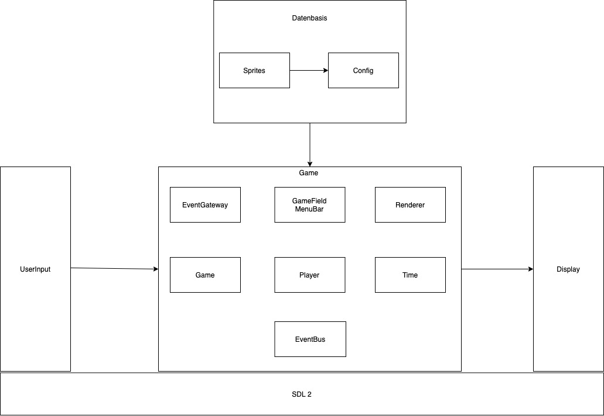
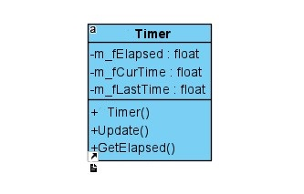

# Trench Tactics

### Inhaltsverzeichnis

- [Inhaltsverzeichnis](#inhaltsverzeichnis)
- [Spielidee und Ziele](#spielidee-und-ziele)
- [Vorbedingungen](#vorbedingungen)
- [Gesamtuebersicht](#gesamtuebersicht)
  - [Framework](#framework)
  - [Architektur](#architektur)
  - [Timer](#timer)
  - [EventManagement](#eventmanagement)
  - [Rendering](#rendering)
  - [Config Reader](#config)

<a name="spielidee-und-ziele"></a>
## Spielidee und Ziele
In der Gamingindustrie geht der Trend hinzu Reboots/Remakes alter und vor allem erfolgreicher Spiele. Fast alle grossen Publisher sind auf diesen Zug augesprungen. Kuerzlich wurde Warcraft 3 Reforged veroeffentlicht, ein Reboot des von Blizzard gepublishtem RTS im Warcraft Universum.
Im Zuge der Suche nach einem geeigneten Thema fuer ein Programmierprojekt hat sich unsere Gruppe dazu entschieden in eine aehnlich Richtung aufzubrechen. Als Basis wurde AdvanceWars ausgewaehlt, ein Nintendo GameBoy Advance Spiel. AdvanceWars ist ein rundenbasiertes Strategiespiel in dem der Spieler verschiedene Militaerische Einheiten kontrollieren und diese taktisch klug bewegen um den Gegner zu besiegen.
Dieses Konzept wird quasi als Basis fuer TrenchTactics uebernommen. Zwei Spieler die auf einer Karte aggieren und Einheiten kaufen, bewegen und mit ihnen kaempfen koennen. Ziel des Spiels ist das gegnerische Hauptgebaeude zu zerstoeren. In unserer Version wird das Spiel als Hot-Seat Spiel entwickelt, dies bedeutet das die beiden Spieler abwecheselnd and einem Client spielen und ihre Aktionen durchfuehren.
Diese Basis wird dann in Gewissen Aspekten weiterentwickelt. Moderne Element sollen in das "alte" Spielkonzept mit einfliessen. Das "AutoBattler" Genre ist genau so ein modernes Spielkonzept das erst in den letzten Jahren gross geworden ist, aus eben diesem Genre werden zwei wichtige Konzepte mit in TrenchTactics einfliessen. 
Das erste Konzept ist die Mechanik das Einheiten, die dem Spieler zum Kaufen zur Verfuegung gestellt werden, per Zufall ausgewaehlt werden. Diese Zufallsauswahl kann dann von dem Spieler erneut ausgefuehrt werden um eine neue Auswahl an Einheiten zu bekommen.
Hierfuer wird entsprechend eine Waherung benoetigt um einen solchen "ReRoll" zu bezahlen. Deswegen wird hier, wieder aus dem AuoBattler Genre, die naechste Erweiterung geklaut und ein Wirtschaftsystem implementiert. Verschiedene Faktoren haben hier Auswirkung auf das Einkommmen das Runde fuer Runde an die Spieler ausbezahlt wird. Hierzu gibt es noch einen eigenen Abschnitt der das Wirtschaftssystem noch genauer erklaert.

## Vorbedingungen
Bisher wurde TrenchTactics nur fuer Windows compiled - den Versuch andere Betriebssysteme zu nutzen bitte nur auf eigene Gefahr!
Um das Projekt zum jetzigen Zeitpunkt benutzen zu koennen und zu debuggen werden folgende Frameworks und Software benoetigt:
- Visual Studio 2019
- SDL2.dll
- SDL2_tff.dll
- zlib1.dll
- libfreetype-6.dll

Alle dlls sind jedoch mit im Repository hinterlegt und muessen somit nicht manuell mit eingebunden werden, wenn die precompiled Version genutzt wird.

Derzeit wird TrenchTactics als Console Application compiled, um eine reine Executeable zu compilen muss eine kleine Codeveraenderung vorgenommen werden. Die rot unterstrichene Zeile muss entfernt werden:


#### Folgende Einstellungen unter Project Properties muessen getroffen werden um TrenchTactics mit VisualStudio 2019 kompilieren zu koennen:

###### General Settings

###### VC++ Settings

###### Linker Input Settings


## Gesamtuebersicht

### Framework
Das Framework das im Projekt TrenchTactics ist [SDL2](https://www.libsdl.org/). SDL2 stellt hauptsaechlich Grundfunktionalitaeten zur Verfuegung, in unserem Projekt speziell:
- Laden der einzelnen Sprites die im Spiel verwendet werden
- Darstellen der Sprites
- Animation der Sprites
- Annahme des UserInput per Maus (bisher ist kein Keyboard-Input moeglich)

### Architektur


In Oben zu sehenden Bild gibt es einen kurzen Ueberblick ueber die Architektur im Projekt was im folgenden Schritt fuer Schritt immer genauer erklaert werden soll.

Die Architektur kann grundsaetzlich grob in die fuenf deutlich zu sehenden Elemente unterteilt werden. 

User Input wird durch die erste Komponente entegegen genommen, dann in der grossen Komponente "Game", unter zuhilfenahme der Datenbasis, verarbeitet und dann dem User entsprechend wieder angezeigt. All diese Komponenten bauen auf verschiedenen Low-Level Funktionen von SDL2 auf und werden jetzt, Baustein fuer Baustein, erklaert.

Im gesamten Projekt wurde darauf geachtet die Verbindung zu SDL2 nicht zu starr zu implementieren. Nahezu jede SDL Funktion wurde hinter Interfaces "versteckt". Am besten zu sehen am Beispiel des EventManagers der den UserInput behandelt. (genauer zu sehen im spezifischen Kapitel)

#### Timer


TrenchTactics ist ein Timer bzw Tick based Spiel. Dies bedeutet das Aktionen jeweils pro Tick abgearbeitet werden.
Angenommen ein der User betaetigt einen Knopf wird diese Aktion (in diesem Fall von SDl2) gespeichert und nach jedem Tick durch die jeweilig zustaendigen Funktionen verarbeitet. (zu sehen im Kapitel EventManager: processEvents()) 
Dies hat den eindeutigen Vorteil das dadurch kein Gedanke an Threading verschwendet werden muss. Die Nachteile die sich dadurch ergeben wuerden, wie etwa Latenz, sind jedoch fuer TrenchTactics nicht allzu ausschlaggebend und werden somit gekonnt ignoriert.

In der Timer Klasse wird die letzte Zeit (Tick), bereits vergangene Zeit und jetztige Zeit gespeichert und durch aufrufen der Funktion Update aktualisiert.
Diese Funktion wird bei jedem update des Spiels aufgerufen. Hier wird dann auch die Zeit ueberprueft und ein entsprechender "sleep" eingebaut der dafuer sorgt das der Ablauf des Spiels nicht zu schnell passiert.
Ebenfalls ist hier zu sehen das die SDL Funktion GetTicks aufgerufen wird,die die Anzahl der bereits vergangenen Ticks zurueckgibt. 


```c++
/**
 * updates timer data to the next tick.
 *
 */
void CTimer::Update()
{
	m_fCurTime = SDL_GetTicks() / 1000.0f;
	m_fElapsed = m_fCurTime - m_fLastTime;
	m_fLastTime = m_fCurTime;
}
```
#### EventManagement
Als Grundkonzept fuer das Eventmanagement wurde ein so gennanter EventBus eingefuehrt. Der uber publish/subscribe Methoden Events an LogikKomponenten ubergibt. Technisch regestriert sich eine Methode aus einer Klasse fuer ein Event und gibt an welche Funktion fuer das entsprechende Event ausgefuehrt werden soll.
```c++
EventBus::instance().subscribe(this, &Game::handleStartGame);
void Game::handleStartGame(StartGameEvent* event);
```
In der ersten Zeile sieht man hier die subscribe Mehtode, die als Argumente die Instanz der ausfuehrenden Klasse sowie die Methode der Klasse die sich um das Event kuemmern soll. 
Die zweite Zeile beschreibt dannn die Methode die das Event behandelt. Hier wird als Parameter das spezialisierte Event angegeben. Uber diesen Parameter wird dann im EventBus auch entschieden ob die Funktion aufgerufen wird oder nicht.


In der Ubersicht sieht man alle moeglichen Events die verwendet werden. Auf das ein oder andere Event wird spaeter noch genauer eingegangen.

Der Publish des Events funktioniert dann aequivalent einfach. Uber eine Instanz des EventBus wird ein Event instance ueber die publish Funktion an alle Abonennten verteilt.
```c++
EventBus::instance().publish(new DeathEvent(this->getptr()));
```
Zusaetzlich zum EventBus gibt is im Event Kontext noch den EventManager an sich:


In dieser Klasse werden User Eingaben behandelt. Dies bedeutet hier werden Events erzeugt und auf den EventBus gelegt und dann entsprechender Stelle behandelt. 
Als Abstraktions Ebene wurde hier ein Interface eingezogen hinter dem sich dann die SDL2 spezifischen Aktionen verstecken.
Die Implementierung basiert hier auf, wie eben erwaehnt, SDL2 Funktionen. Technisch wird hier dann pro Timer Tick ueber die Funktion 
```c++ 
SDL_PollEvent(&Event)
```
geprueft ob ein Event innerhalb des letzten Ticks vorgefallen ist und dann wie erwaehnt umgewandelt und weitergeleitet.

#### Rendering
Das Rendern der verschiedenen Sprites nutzt hier wieder ein SDL2 interne Funktion


Wird genau wie der EventManger hinter einem Interface versteckt - dies gewaehrleistet das, falls noetig, ein Framework wechsel nicht eine komplette Code Aenderung mitsich bringt.

Jede Ressource die gerendert werden soll hat eine Referenz zu einer Instanz der Klasse Sprite:
```c++
m_sprite = make_shared<SpriteUnit>(colorRed, unittype);
```
Hier im Beispiel der Unit Klasse die bei der Erstellung anhand des Unittype die entsprechende Sprite laed. Diese Sprite Klasse:


Wie man erkennen kann beinhaltet die Klasse alle noetigen technischen Mittel um die entsprechende Sprite zu laden.
Technisch wird ueber einen filepath die Sprite geladen. Dann kann entweder die komplette Sprite oder nur einen Ausschnitt an einer bestimmten Position gerendert werden. Dies laeuft dann uber die Referenz auf den SDL Renderer der ueber die RendererImpl bereitgestellt wird.
Genauer Ablauf als Aktivitaetsdiagramm:
HIER BILD EINFUEGEN
Ausserdem gibt es hier die Moeglichkeit Animationen zu realisieren. Dies funktioniert ueber die eben erwaehnten Ausschnitte:


In diesem Bild sieht man die einzelnen Ausschnitte der Animation, mit Hilfe der verschiedenen Ausschnitte und mit Hilfe des Timers koennen so Animationen angezeigt werden. Nach jedem Tick wird der nachste Ausschnitt geladen.
Als kleine Side-Note: Hier sieht man die pinke Hintergrundfarbe, diese wird verwendet um die Sprite vom Hintergrund zu trenne. Bedeutet nur die wirklichen Pixel der Unit werden gerendert.